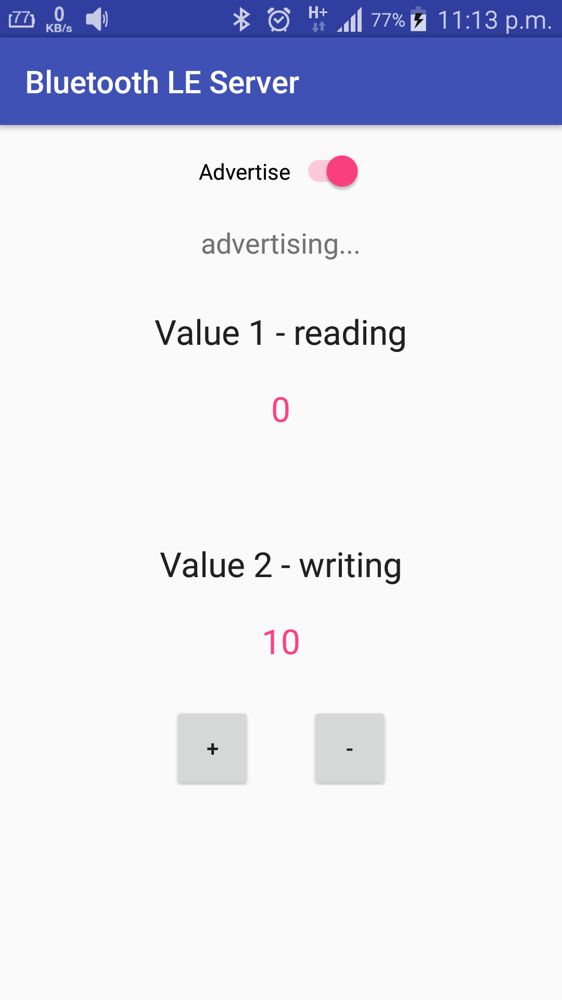

# Bluetooth-LE-Server
Sample Android app to demonstrate a Bluetooth LE Server to change 2 values

Basically Value 1 us used for reading and can be changed by the client. Value 2 is for writing and once a change to this
value us being done it will be notified to the connected client.

Note: Android Bluetooth LE Server is possible only from API 21 onwards

# Pre-requisites 
<ul>
<li>Android SDK v23</li>
<li>Android Build Tools v23.0.3</li>
<li>Android Support Repository</li>
</ul>

# Screenshots

